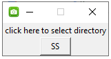

# A simple and minimalist desktop app to take screenshots. #

A minimalist desktop app built in Python, using Tkinter.  
  
Most screenshot apps on desktop force you to choose a directory & save the photo before being allowed to take the next screenshot.  
But I wanted an app that'd save them automatically to a directory.  
The goal is to be able take several successive screenshots in a matter of seconds, as we do on a smartphone.
  
Things you can customize :
- file names : currently 'SS_' followed by a timestamp in the following format "%d_%m_%Y_%H_%M_%S".
- the interface's size (currently set to not resizable).
- the text on the button (currently set to 'SS').

Update : added the option to pick and change directory

  

